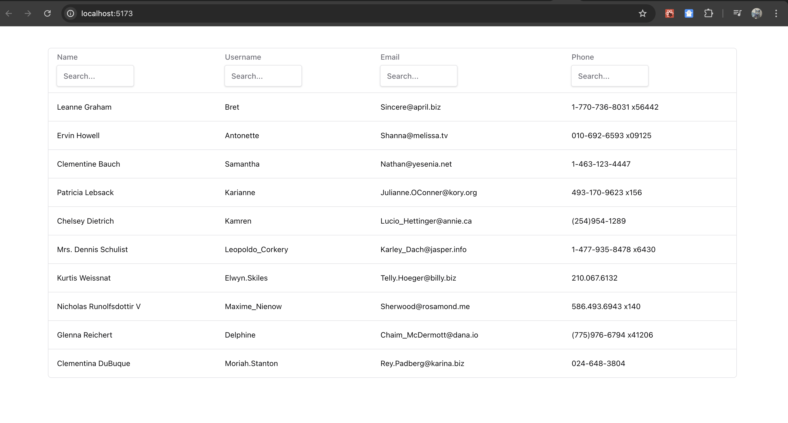

## Scripts

- `dev` - start dev server and open browser
- `build` - build for production
- `preview` - locally preview production build
- `test` - launch test runner

## Stack

- React
- Vite
- Redux Toolkit
- TypeScript
- TanStack Table
- shadcn/ui

## Preview

